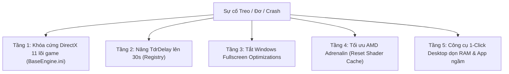

# ⚔️ TFT Anti-Crash & Windows 11 Game Optimizer (AMD Ryzen / Radeon Edition)

[](https://opensource.org/licenses/MIT)
[](https://www.microsoft.com/windows)
[-green)](https://learn.microsoft.com/windows/win32/direct3d11)
[](https://teamfighttactics.leagueoflegends.com/)

> Bộ công cụ và giải pháp kỹ thuật toàn diện giúp khắc phục triệt để hiện tượng **treo đơ máy, đứng màn hình (Freeze / Hang / Crash)** khi chơi **Đấu Trường Chân Lý (TFT Standalone)** và **Liên Minh Huyền Thoại (LoL)** trên Windows 11 và vi xử lý AMD Ryzen tích hợp đồ họa Radeon Graphics (Vega).

---

## 📌 1. Bối cảnh & Hiện tượng (Symptoms)

* **Cấu hình phần cứng:**
  * **CPU:** AMD Ryzen 7 5800H (8 nhân, 16 luồng) hoặc các dòng Ryzen 4000/5000/6000/7000 series.
  * **GPU:** AMD Radeon™ Graphics tích hợp (Vega 7 / Vega 8 / RDNA).
  * **RAM:** 16 GB.
  * **Hệ điều hành:** Windows 11 (Build 22631+ / 23H2), thiết lập **2 màn hình (Dual Monitors)**.
* **Hiện tượng gặp phải:**
  * Đang trong trận ĐTCL hoặc lúc tải trận thì khung hình bị khựng lại, chuột không di chuyển được hoặc toàn bộ Windows bị treo cứng.
  * Màn hình đen chớp tắt rồi văng game, hoặc máy đơ hoàn toàn buộc người dùng phải giữ nút nguồn để khởi động lại.

---

## 🔍 2. Phân tích nguyên nhân gốc rễ từ Tệp Nhật ký (Root Cause Analysis)

Qua giải mã chi tiết các tệp nhật ký thực tế (`TFT.log`, `r3dlog.txt`, crash dumps từ Sentry), sự cố bắt nguồn từ **4 xung đột phần mềm - phần cứng đồng thời**:

```text
[07:56:30] LogD3D12RHI: Error: Failed to create pipeline state with combined hash 1470F2D7F4934338, error 887a0005.
[07:56:30] LogD3D12RHI: Error: hr failed at WindowsD3D12PipelineState.cpp:856 
           with error DXGI_ERROR_DEVICE_REMOVED with Reason: DXGI_ERROR_DEVICE_HUNG
```

### A. Bản TFT mới (Unreal Engine 5) tự ép chạy DirectX 12 lỗi trên GPU AMD Vega
* Phiên bản Đấu Trường Chân Lý độc lập (`TFTClient-Win64-Shipping.exe`) được chuyển đổi sang động cơ đồ họa **Unreal Engine 5**.
* Mặc định, UE5 ưu tiên nạp mô-đun **DirectX 12 RHI (`LogD3D12RHI`)**. 
* Tuy nhiên, trên kiến trúc đồ họa tích hợp AMD Vega (GCN 5), trình biên dịch Shader D3D12 khi kết hợp cùng thư viện Agility SDK của Unreal Engine bị lỗi tạo Pipeline State Object (mã lỗi `887a0005`), khiến card màn hình bị treo hoàn toàn (**`DXGI_ERROR_DEVICE_HUNG`**).
* *Riot Games đã khuyến cáo cấu hình tối thiểu chuẩn là **DirectX 11 (Feature Level 4.3) và Shader Model 5**.*

### B. Thời gian chờ phát hiện treo đồ họa mặc định của Windows quá ngắn (`TdrDelay = 2s`)
* Windows trang bị cơ chế bảo vệ **TDR (Timeout Detection and Recovery)**: Nếu GPU không phản hồi trong vòng **2 giây**, Windows sẽ tự động kết luận driver đồ họa đã bị hỏng và cưỡng chế ngắt/reset driver.
* Khi chơi game ở chế độ Không viền (Borderless) trên 2 màn hình, mỗi lần chuyển đổi cửa sổ, DirectX phải tái cấu trúc tài nguyên (`RecreateOwnedResources`), tạo ra các khoảng trễ khung hình lên đến **2.66 giây**. Do vượt quá mốc 2s của Windows, hệ thống lập tức ngắt card đồ họa gây sập game.

### C. Cơ chế tự động ghi đè cấu hình của Unreal Engine
* Khi cấu hình DirectX 11 trong file `%LOCALAPPDATA%\TFT\Saved\Config\WindowsClient\Engine.ini`, bộ ghi cấu hình nội bộ của Unreal Engine (`GConfig->Flush()`) sẽ tự động xóa sạch các thiết lập tùy chỉnh mỗi lần game khởi động lại và ép máy quay trở lại DirectX 12.

### D. Xung đột Overlay và Tiến trình máy ảo ngầm
* **Overwolf / MetaTFT** và **AMD In-Game Overlay** đồng thời chèn móc (hook) vào luồng render DirectX 11/12 của game, cạnh tranh tài nguyên với trình chống gian lận cấp nhân **Riot Vanguard**.
* Các tiến trình máy ảo chạy ngầm (BlueStacks, Docker Desktop, WSL, VMware) chiếm dụng tới 12 GB RAM và tạo ra độ trễ ngắt DPC (DPC Latency Spikes) cao, gây giật lag chuột và đóng băng hệ thống.

---

## 🛡️ 3. Cơ chế Giải pháp 5 Tầng (Comprehensive Solutions)

Dự án này áp dụng cơ chế xử lý 5 tầng triệt để:



1. **Khóa cứng DirectX 11 ở cấp độ gốc của bộ cài game:**
   * Can thiệp trực tiếp vào `BaseEngine.ini` tại đường dẫn cài đặt gốc `E:\Riot Games\Teamfight Tactics\Live\Engine\Config\BaseEngine.ini`.
   * Thiết lập `DefaultGraphicsRHI=DefaultGraphicsRHI_DX11` và `r.RHIName=D3D11`.
   * Khóa file `Engine.ini` người dùng ở trạng thái **Read-Only (Chỉ đọc)** để ngăn game tự động ghi đè quay lại DirectX 12.
2. **Nâng thời gian chờ TDR của Windows lên 30 giây:**
   * Tăng `TdrDelay` và `TdrDdiDelay` trong `HKLM\SYSTEM\CurrentControlSet\Control\GraphicsDrivers` từ **2 giây $\rightarrow$ 30 giây**. GPU có đủ thời gian dựng cảnh phức tạp mà không sợ bị Windows ngắt ngang.
3. **Vô hiệu hóa Fullscreen Optimizations của Windows 11:**
   * Gắn cờ tương thích `~ DISABLEDXMAXIMIZEDWINDOWEDMODE HIGHDPIAWARE` cho `TFTClient-Win64-Shipping.exe` và `League of Legends.exe`, loại bỏ xung đột DWM trên hệ thống đa màn hình.
4. **Tối ưu hóa phần mềm AMD Software: Adrenalin:**
   * Tự động xóa sạch bộ nhớ đệm Shader D3D12 bị lỗi (`DxcCache` & `DxCache`).
   * Tắt **In-Game Overlay** và đưa Graphics Profile về trạng thái **Default / Standard**.
5. **Đóng gói công cụ 1-Click Desktop (`ToiUu_ChoiGame.bat`):**
   * Tự động xin quyền Administrator (UAC).
   * Tắt sạch các tiến trình kẹt ngầm, giải phóng ngay 6 - 8 GB RAM từ BlueStacks, Docker, WSL, VMware và Overwolf trước khi mở game.

---

## 🚀 4. Hướng dẫn Cài đặt & Sử dụng (Quick Start)

### Cách 1: Sử dụng công cụ tự động 1-Click (Khuyên dùng)
1. Tải toàn bộ kho lưu trữ về máy (hoặc tải trực tiếp tệp `ToiUu_ChoiGame.bat`).
2. Nhấp chuột phải vào `ToiUu_ChoiGame.bat` $\rightarrow$ chọn **Run as Administrator** (hoặc nhấp đúp vào Shortcut ngoài Desktop).
3. Cửa sổ công cụ sẽ tự động thực thi trong 3-5 giây và hiển thị thông báo hoàn tất:
   ```text
   ====================================================================
     HOAN TAT! DA KHOA DIRECTX 11 VA DON SACH SHADER AMD BI LOI!
     Bao gom:
       [v] TdrDelay = 30 giay (GPU load nang khong bao gio bi kill).
       [v] Ep chuyen sang DirectX 11 on dinh (Loai bo loi D3D12).
       [v] Xoa sach Shader Cache bi loi cua AMD.
       [v] Giai phong RAM tu BlueStacks, WSL & VMware.
   ====================================================================
   ```
4. Mở **Riot Client** và vào trận đấu.

### Cách 2: Thiết lập thủ công trong AMD Software: Adrenalin Edition
1. Mở **AMD Software: Adrenalin Edition**.
2. **Tắt Overlay:** Vào biểu tượng **Cài đặt (Bánh răng)** $\rightarrow$ Tab **Preferences** $\rightarrow$ Gạt tắt **In-Game Overlay**.
3. **Cấu hình Đồ họa:** Vào Tab **Gaming** $\rightarrow$ Mục **Graphics**:
   * Đặt Profile thành **Default / Standard**.
   * Đảm bảo tắt: *Radeon Anti-Lag*, *Radeon Boost*, *Radeon Enhanced Sync*.
   * Nhấp vào **Advanced** $\rightarrow$ tìm dòng **Reset Shader Cache** $\rightarrow$ Bấm **Perform Reset**.

---

## 📁 5. Cấu trúc Thư mục Dự án

```text
tft-anti-crash-optimizer/
├── .gitignore                   # Danh sách loại trừ tệp rác / log
├── LICENSE                      # Giấy phép bản quyền MIT
├── README.md                    # Tài liệu kỹ thuật chi tiết
├── Setup_DX11_Optimizer.ps1     # Script PowerShell cấu hình sâu hệ thống
└── ToiUu_ChoiGame.bat           # File Batch 1-Click tự động hóa cho người dùng
```

---

## ❓ 6. Câu hỏi thường gặp (FAQ)

**Q: Máy tôi cấu hình rất mạnh (Ryzen 7, 16GB RAM) sao lại đơ máy khi chơi ĐTCL?**  
> **A:** Sự cố này hoàn toàn là lỗi xung đột phần mềm: engine đồ họa UE5 cố chạy DirectX 12 trên GPU tích hợp AMD, kết hợp với cơ chế ngắt card sau 2s của Windows và xung đột khi cắm 2 màn hình. Phần cứng của bạn rất mạnh và hoàn toàn thừa sức chơi game ở 100+ FPS trên nền DirectX 11.

**Q: Sau khi Riot cập nhật bản vá mới (Patch Update), tôi có cần chạy lại tool không?**  
> **A:** Nếu Riot tung bản cập nhật lớn ghi đè lại file `BaseEngine.ini`, bạn chỉ cần nhấp đúp chạy lại `ToiUu_ChoiGame.bat` một lần để đảm bảo DirectX 11 luôn được khóa chặt.

---

## 👤 Tác giả (Author)
* **GitHub:** [@HTP8888](https://github.com/HTP8888)
* **Dự án:** [tft-anti-crash-optimizer](https://github.com/HTP8888/tft-anti-crash-optimizer)

---

## 📄 Giấy phép (License)
Dự án được phân phối dưới giấy phép mã nguồn mở **MIT License**. Chi tiết xem tại tệp [LICENSE](LICENSE).
